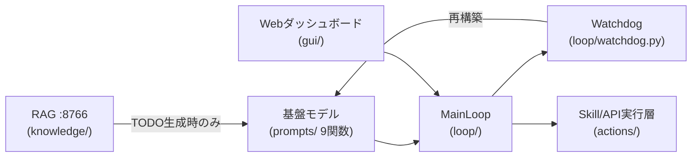

# VLMAutoReplayTool

「基盤モデルによる計画」と「専用モデル・スキル・APIによる実行」を分離したゲーム自動プレイエージェントのコア骨格実装。設計は [`VLMAutoReplayTool_DESIGN.md`](VLMAutoReplayTool_DESIGN.md) を参照。`VLMAutoReplayTool_UI_DESIGN.md` はSentri風の汎用デザイントークン集で、本ツール固有の画面仕様は未定義のため、GUIダッシュボードの配色・タイポグラフィのみに適用している。

**技術ドキュメント**: 各Phaseのアーキテクチャ図・シーケンス図(Mermaid)付きの詳細な技術解説書を用意している。
- [`docs/TECHNICAL_OVERVIEW.md`](docs/TECHNICAL_OVERVIEW.md) — Markdown版(GitHub上でMermaid図がそのまま描画される)
- [`docs/technical-overview.html`](docs/technical-overview.html) — HTML版(ブラウザで開くとSentri風デザインで閲覧できる。`mermaid.js`をCDNから読み込むためオンライン環境推奨)

### アーキテクチャ概観



## 実装範囲(今回のスコープ)

設計書のPhase0〜7のうち、**Phase1〜5をフル実装**し、実データフローが通る状態にした。Phase6/7(スキル自動抽出・視覚的自己位置推定)は設計書自身が「複数回反復が前提」と明記しているR&D領域のため、実データで動く軽量な実装+反復ポイントをTODOコメントで明示する形にとどめている。

| Phase | 内容 | 実装状態 |
|---|---|---|
| Phase1 | プロンプトテンプレート層(9関数) | `src/vlm_auto_replay/prompts/` フル実装 |
| Phase2 | メインループ+StepLog | `src/vlm_auto_replay/loop/main_loop.py` フル実装 |
| Phase3 | Action実行層(Skill/API+HID) | `src/vlm_auto_replay/actions/` フル実装(ViGEm/SendInputは実装済みだが実機ドライバ依存) |
| Phase4 | 知識ソース+RAG(TODO生成時限定) | `src/vlm_auto_replay/knowledge/` フル実装 |
| Phase5 | Watchdog+TODO再構築 | `src/vlm_auto_replay/loop/watchdog.py` フル実装 |
| Phase6 | スキル自動抽出 | `src/vlm_auto_replay/skills/` 軽量実装(TODOコメントあり) |
| Phase7 | ナビゲーション推論 | `src/vlm_auto_replay/navigation/` 軽量実装(TODOコメントあり) |

## 動作確認手順(クイックスタート)

初めて動かす場合は上から順に実行すれば良い。すべてWindows PowerShell/Git Bash想定、リポジトリ直下で実行する。

**1. 仮想環境を作り、依存関係(テスト+GUI)をインストールする**

```bash
python -m venv .venv
.venv/Scripts/pip install -e ".[dev,gui]"
```

**2. 自動テスト(40件)を実行し、コアエンジンが正しく動くことを確認する**

```bash
.venv/Scripts/pytest -q
```

`56 passed` と表示されれば、Phase1〜7のコアロジック(型付きプロンプト関数・メインループ・Skill/API実行・RAG境界・Watchdog・スキル抽出・ナビゲーション)とGUI(FastAPIエンドポイント+SQLite永続化)がすべて正常。

**3. GUIサーバを起動する**

```bash
.venv/Scripts/python -m vlm_auto_replay.gui
```

`Uvicorn running on http://127.0.0.1:8765` と表示されたら起動完了(終了するには実行中のターミナルで `Ctrl+C`)。

**4. ブラウザで `http://127.0.0.1:8765` を開き、実際に操作する**

1. 「ゴール分解」欄に適当な目標(例: `ボスを撃破する`)を入力して **分解する** をクリック → 3件のTODOカードが表示される
2. 好きなTODOカードの **実行開始** をクリック → プログレスバーが進み、数秒おきにStepLog(サムネイル・reasoning・action・result)がライブで積み上がっていくのが見える
3. ヘッダー右上のSTATUSが `RUNNING` → `DONE` に変わることを確認する
4. 実行中に **停止** ボタンを押すと、その場でSTATUSが `STOPPED` になることを確認する(Watchdogの停止経路の確認)
5. 「スキルライブラリ」パネルに `demo-skill-1`(procedureスキル)が表示されていることを確認する。ゲーム名+手順テキストを入力して **スキルを追加** すると即座に一覧へ反映され、**削除** で取り除けることも確認する
6. 「実行履歴」パネルに今実行したRunが表示され、**ログを見る** をクリックするとそのRunのStepLog一覧が下に表示されることを確認する
7. サーバーをいったん `Ctrl+C` で止めて再度 `python -m vlm_auto_replay.gui` すると、追加したスキルと実行履歴が消えずに残っていることを確認する(`~/.vlm_auto_replay/gui.sqlite3` にSQLiteで永続化されている)
8. 別のTODOで「🐢 Watchdog介入をデモする」にチェックを入れてから **実行開始** をクリックすると、意図的に完了しないゲームに対してWatchdogが8ステップで自動介入し、STATUSが `INTERVENED` になる。Watchdogパネルに介入理由のバナーが表示され、「ゴール分解」パネルのTODOリストが自動で再構築された新しいTODOに置き換わることを確認する

実VLM・実HID(ViGEm/SendInput)を使わない**デモモード**で動くため、APIキーやドライバのセットアップなしにこの一連の流れを確認できる。実モデル/実HIDへの差し替え方は次項参照。

**5.(任意)Windows実機でのHID制御を使う場合**

```bash
.venv/Scripts/pip install -e ".[hid]"
```

(別途 [ViGEmBus](https://github.com/ViGEm/ViGEmBus) ドライバのインストールが必要)

## モデル・HIDバックエンドの差し替え

- 基盤モデル呼び出しは `prompts/model_client.py` の `FoundationModelClient` Protocolを実装し、`configure_model_client()` で注入する。テストでは決定的な `ScriptedFoundationModelClient` を使用している。実運用ではVLM APIをラップした実装を注入する(ベンダー名はループ本体に埋め込まない)。
- HID実行は `actions/api_primitives.py` の `PadBackend` / `KeyboardMouseBackend` / `OcrBackend` を実装して差し替える。実機用に `ViGEmPadBackend`(ViGEm経由)・`SendInputBackend`(ctypes経由)を用意し、テスト・未接続環境向けに `NullPadBackend` 等を用意している。

## ディレクトリ構成

```
src/vlm_auto_replay/
  prompts/     Phase1 プロンプトテンプレート層
  loop/        Phase2 メインループ+StepLog、Phase5 Watchdog
  actions/     Phase3 Skill/API実行層+HIDプリミティブ+サンドボックス
  knowledge/   Phase4 RAGクライアント+Experience
  skills/      Phase6 スキル自動抽出+受け入れゲート
  navigation/  Phase7 視覚的自己位置推定パイプライン
  gui/         操作用Webダッシュボード(FastAPI+静的フロントエンド)
tests/
  fixtures/fake_game.py  Final Phase向け決定的フェイクゲーム
```
