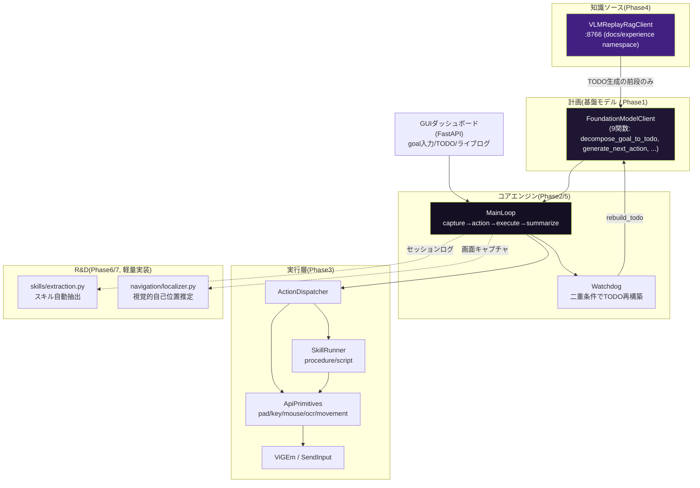
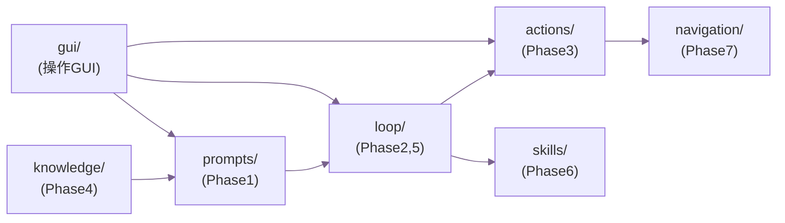
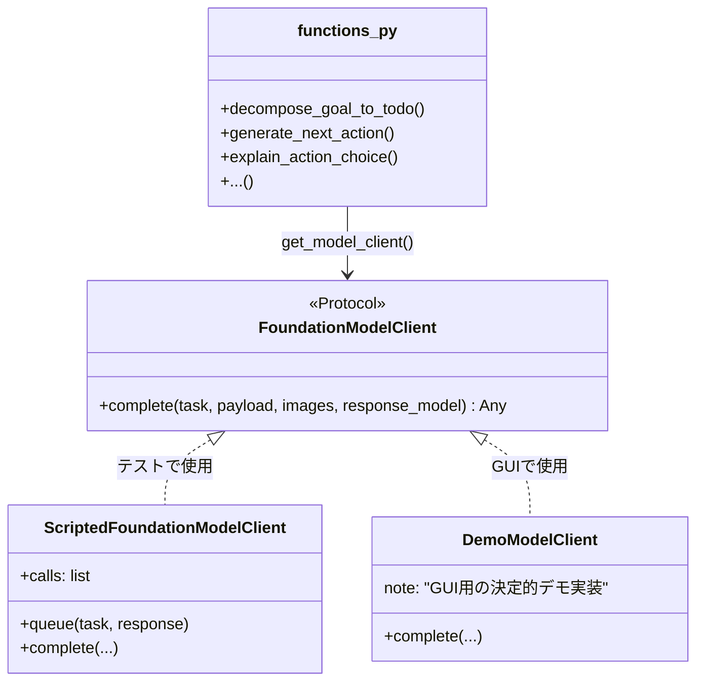
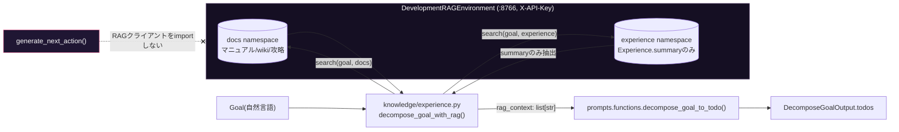
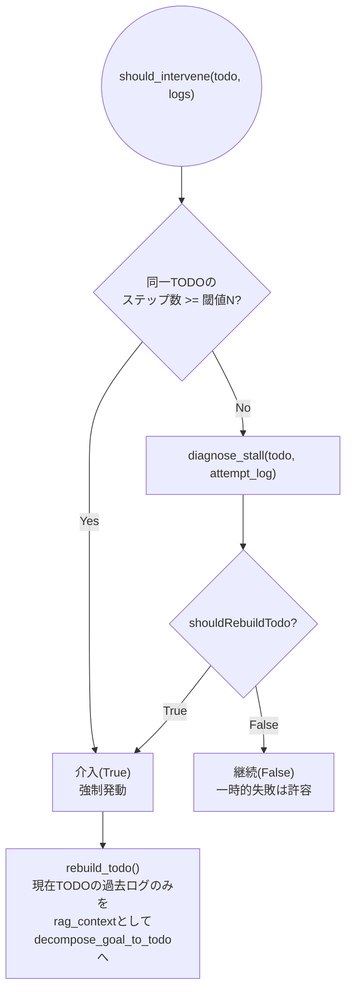
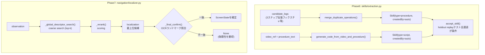

# VLMAutoReplayTool 技術解説書

対象読者: このリポジトリのコードを読む・拡張する・テストする開発者。
設計の一次情報は [`VLMAutoReplayTool_DESIGN.md`](../VLMAutoReplayTool_DESIGN.md)(Phase0〜7)。本書はそれを**現在の実装(コード)に即して**説明するリファレンスであり、設計書とコードが食い違う場合はコード側(このリポジトリの`src/`)を正とする。

HTML版(同内容、ブラウザでの閲覧向け): [`technical-overview.html`](technical-overview.html)

---

## 1. 全体像

「計画(基盤モデル)」と「実行(専用モデル・スキル・API)」を分離したゲーム自動プレイエージェント。中核ループは `capture → generate_next_action → execute → 状態変化確認 → repeat` という単純な形を保ち、各ステップの行動理由(reasoning)を必ず記録する。



**アーキテクチャ境界(最重要)**: `generate_next_action` を含む `prompts/functions.py` は `knowledge.rag_client` を一切 import しない。RAGは「TODO生成の前段」(`knowledge/experience.py` の `decompose_goal_with_rag`)にのみ存在し、1ステップの実行サイクル(`generate_next_action`〜`execute`)ではRAG呼び出しが物理的に0回になる。これは `tests/test_rag_boundary.py` でAST静的解析により実証している。

---

## 2. ディレクトリとPhaseの対応

| ディレクトリ | 対応Phase | 役割 | 実装状態 |
|---|---|---|---|
| `src/vlm_auto_replay/prompts/` | Phase1 | 9つのプロンプト意図を型付き関数として固定 | フル実装 |
| `src/vlm_auto_replay/loop/` | Phase2, Phase5 | MainLoop・StepLog・Watchdog | フル実装 |
| `src/vlm_auto_replay/actions/` | Phase3 | Skill(procedure/script)・API primitive・HID・サンドボックス | フル実装(HIDは実機ドライバ依存) |
| `src/vlm_auto_replay/knowledge/` | Phase4 | RAGクライアント・Experience・TODO生成前段オーケストレーション | フル実装 |
| `src/vlm_auto_replay/skills/` | Phase6 | スキル自動抽出・受け入れゲート | 軽量実装(反復前提) |
| `src/vlm_auto_replay/navigation/` | Phase7 | 視覚的自己位置推定パイプライン | 軽量実装(反復前提) |
| `src/vlm_auto_replay/gui/` | — | 操作用Webダッシュボード(FastAPI) | フル実装(デモモデル/デモゲーム同梱) |



---

## 3. Phase1: プロンプトテンプレート層

`prompts/schemas.py` に9つの入出力Pydanticモデル、`prompts/functions.py` に9つの関数(`decompose_goal_to_todo` / `explain_action_choice` / `generate_next_action` / `extract_experience` / `summarize_screen_change` / `merge_duplicate_operations` / `generate_code_from_video_and_procedure` / `extract_reusable_subroutine` / `diagnose_stall`)を定義する。

差し替え可能性は `prompts/model_client.py` の `FoundationModelClient` Protocolで実現する。9関数はモジュールレベルの `get_model_client()` のみを経由してモデルを呼び出すため、`configure_model_client()` で実装を差し替えても **呼び出し側(MainLoop・SkillRunner・Watchdog・GUI)のコードは一切変更不要**。



---

## 4. Phase2: MainLoop + StepLog

```mermaid
sequenceDiagram
    participant Loop as MainLoop.run()
    participant Cap as ScreenCapture
    participant FM as FoundationModelClient(9関数)
    participant Exec as ActionExecutor
    participant WD as Watchdog
    participant Sink as StepLogSink

    loop 1ステップ
        Loop->>Cap: capture()
        Cap-->>Loop: observation(before)
        Loop->>FM: generate_next_action(todo, obs, history, guidance_text)
        FM-->>Loop: NextActionOutput
        Loop->>FM: explain_action_choice(action, context)
        FM-->>Loop: reasoning
        Note over Loop: reasoningが空ならAssertionError(監査可能性)
        Loop->>Exec: execute(action)
        Loop->>Cap: capture()
        Cap-->>Loop: observation(after)
        Loop->>FM: summarize_screen_change(before, after)
        FM-->>Loop: resultObservationSummary
        Loop->>Sink: log_step(StepLog)
        Loop->>WD: should_intervene(todo, logs)
        alt 介入すべき
            WD-->>Loop: true
            Loop->>Loop: break
        else 継続
            WD-->>Loop: false
            Loop->>Loop: todo_done_checker(todo, after)で完了判定
        end
    end
```

`StepLog` は `stepIndex` / `timestamp` / `todoId` / `observationRef` / `reasoning` / `actionTaken` / `resultObservationSummary` の7フィールドを毎ステップ非nullで持つ。固定ディレイでの前進ではなく `resultObservationSummary` の生成後にのみ次のステップ判定に進む(`main_loop.py` にはどこにも `sleep` 呼び出しが存在しない — `tests/test_main_loop.py::test_main_loop_progresses_only_via_state_change_not_fixed_delay` がソースコードを走査してこれを検証している)。

---

## 5. Phase3: Action実行層(Skill/API二層+HID)

```mermaid
flowchart TD
    NA["NextActionOutput\n{actionType, actionId, params}"] --> DP{ActionDispatcher}
    DP -->|actionType=="api"| API["ApiPrimitives\npad_input/key_input/mouse_move/ocr/movement"]
    DP -->|actionType=="skill" かつ type=="script"| SB["ScriptSandbox.execute()\n(サンドボックス実行)"]
    DP -->|actionType=="skill" かつ type=="procedure"| ERR["ValueError\n(1ステップでは実行不可)"]

    API --> PAD["ViGEmPadBackend\n(vgamepad, ViGEmBus)"]
    API --> KM["SendInputBackend\n(ctypes, Windows)"]
    API --> OCR["OcrBackend"]

    subgraph ProcedureSkill["procedureスキルは独立TODOとして起動"]
        SR["SkillRunner.run_procedure_skill()"] --> ML2["MainLoop.run(todo, guidance_text=proceduralText)"]
        ML2 --> NA
    end
```

- **procedureスキル**は独立した実行パスを持たない。`SkillRunner.run_procedure_skill` は `MainLoop.run(todo, guidance_text=skill.proceduralText)` を呼び出すだけであり、`guidance_text` は `generate_next_action` に**参考情報として**渡るのみで、逸脱しても実行は妨げられない(非強制性。`tests/test_final_integration.py` で実証)。
- **scriptスキル**は `ScriptSandbox` 内で実行される。`os` / `sys` / `subprocess` / `socket` / `requests` などのimportを `__import__` フック(`_guarded_import`)で遮断する。ただし、これは実用上十分な多層防御であり、Pythonの `exec` ベースである以上、完全な安全境界ではない点をコード内コメントで明記している。

---

## 6. Phase4: 知識ソース+RAG(TODO生成時限定)



新規RAGサービスは構築せず、`DevelopmentRAGEnvironment` の `rag_local_bridge.py`(`:8766`, `X-API-Key`ヘッダ認証)を `docs` / `experience` の2 namespace でそのまま再利用する設計。`Experience{title, summary, problem, betterWay}` のうち、TODO生成に添付されるのは `summary` のみ。

---

## 7. Phase5: Watchdog + TODO再構築



二重条件(閾値到達 **または** `diagnose_stall` の回復不能判定)のいずれかで発火する。`rebuild_todo` の入力スコープは「現在のTODOリスト+そのTODOの過去試行ログ」のみに厳密化されており、他TODOやセッション全体ログは混入しない(`tests/test_watchdog.py::test_rebuild_todo_only_uses_current_todo_logs` で検証)。

---

## 8. Phase6/7: スキル自動抽出・ナビゲーション推論(軽量実装)

設計書自身が「複数回反復が前提」と明記しているR&D領域。実データで動く最小実装を提供し、反復ポイントは各ファイルに `TODO(Phase6反復)` / `TODO(Phase7反復)` として明示している。



- Phase6: `merge_duplicate_operations` により3ステップ反復フィクスチャから正確に1つのマージ済みSkillを生成できることを `tests/test_skill_extraction.py` で検証。
- Phase7: `SimpleHashDescriptorExtractor` は暫定のハッシュベース実装(TODO: CNN埋め込み等へ置換)。`_final_confirm` はPhase3の `ApiPrimitives.ocr()` を再利用し、「もっともらしいが誤った」候補を棄却できることを `tests/test_navigation.py::test_final_confirmation_rejects_plausible_but_wrong_candidate` で検証。

---

## 9. GUIダッシュボード

`src/vlm_auto_replay/gui/` はコアエンジンをブラウザから操作するためのFastAPI製ローカルWebアプリ。実VLM/実HIDの代わりに決定的な `DemoModelClient` / `DemoGame`(`runtime.py`)を既定で使用し、APIキーやドライバなしで即座に動作する。

```mermaid
sequenceDiagram
    participant Browser
    participant API as FastAPI(server.py)
    participant State as RuntimeState(runtime.py)
    participant Thread as バックグラウンドスレッド
    participant Loop as MainLoop

    Browser->>API: POST /api/todo/decompose {goal}
    API->>State: decompose(goal)
    State->>State: decompose_goal_to_todo(goal, rag_context=[])
    State-->>API: todos
    API-->>Browser: todos(JSON)

    Browser->>API: POST /api/run/start {todoId}
    API->>State: start_run(todoId)
    State->>Thread: threading.Thread(daemon)
    Thread->>Loop: MainLoop.run(todo)
    loop ステップごと
        Loop->>State: _LiveStepLogSink.log_step(log)
        Note over State: logsリストにappend(lock保護)
    end
    API-->>Browser: {ok: true}(即時応答)

    loop 1.2秒ごと
        Browser->>API: GET /api/status
        API->>State: snapshot()
        State-->>API: {status, todos, logs, skills, ...}
        API-->>Browser: JSON(ライブ更新)
    end

    Browser->>API: POST /api/run/stop
    API->>State: stop_run()
    State->>Thread: _StoppableWatchdog.stop_requested = True
    Note over Thread: 次のsteploop末尾でshould_intervene()がTrueになりbreak
```

フロントエンド(`gui/static/`)は `VLMAutoReplayTool_UI_DESIGN.md`(Sentri風トークン)の配色・タイポグラフィに準拠: ダークキャンバス(`surface-night` #150f23)、カードは `ink-deep` #1f1633+`hairline-violet`境界線、ゴールキーワードに `accent-lime` #c2ef4e のチップ、フォントはRubik、StepLogのaction/summary表示はMonaco系コードフォント。

実運用のモデル/HIDに差し替える場合は、`vlm_auto_replay.gui.server` をimportする前に `configure_model_client()` で実クライアントを設定しておけばよい(`server.py` の `_ensure_model_client_configured()` が既存設定を尊重し、未設定時のみデモ実装にフォールバックする)。

---

## 10. テスト戦略

`tests/` 配下、40件。決定的フェイクゲーム(`tests/fixtures/fake_game.py`)を用い、実VLM/実HIDなしでコアフローをエンドツーエンドに近い形で検証する。

| ファイル | 検証内容 |
|---|---|
| `test_prompts.py` | Phase1: 9関数の型付き入出力、モデル差し替え可能性 |
| `test_main_loop.py` | Phase2: 決定的完走、状態変化駆動の進行、`stepIndex`の単調性、reasoning必須 |
| `test_watchdog.py` | Phase5: 二重条件、再構築スコープの厳密化 |
| `test_skill_runner.py` | Phase3: procedure/script二層、サンドボックス、ActionDispatcher |
| `test_rag_boundary.py` | Phase4: RAG境界のAST静的解析+コールカウント実証 |
| `test_skill_extraction.py` | Phase6: 3ステップ反復→1マージ済みSkill、受け入れゲート |
| `test_navigation.py` | Phase7: 4段パイプラインの分離、偽陽性防御、状態遷移グラフ整合性 |
| `test_final_integration.py` | Final Phase: procedureスキルの非強制性(逸脱の許容) |

```bash
.venv/Scripts/pytest -q
```

---

## 11. 差し替えポイント一覧

| 差し替え対象 | Protocol/場所 | 既定実装 | 本番実装の例 |
|---|---|---|---|
| 基盤モデル呼び出し | `prompts/model_client.py::FoundationModelClient` | `ScriptedFoundationModelClient`(テスト)/`DemoModelClient`(GUI) | Claude/GPT-4V等のVLM APIラッパー |
| パッド入力 | `actions/api_primitives.py::PadBackend` | `NullPadBackend` | `ViGEmPadBackend`(要ViGEmBus) |
| キーボード・マウス | `actions/api_primitives.py::KeyboardMouseBackend` | `NullKeyboardMouseBackend` | `SendInputBackend` |
| OCR | `actions/api_primitives.py::OcrBackend` | `ScriptedOcrBackend` | pytesseract/easyocr等をラップした実装 |
| 画面キャプチャ | `loop/main_loop.py::ScreenCapture` | `DemoGame`(GUI) / フェイクゲーム(テスト) | `mss`等による実画面キャプチャ |
| 画像特徴抽出(Phase7) | `navigation/localizer.py::DescriptorExtractor` | `SimpleHashDescriptorExtractor` | CNN埋め込み/CLIP等 |

すべて呼び出し側コード(MainLoop・SkillRunner・Watchdog・GUI)を変更せずに差し替え可能な設計になっている。
